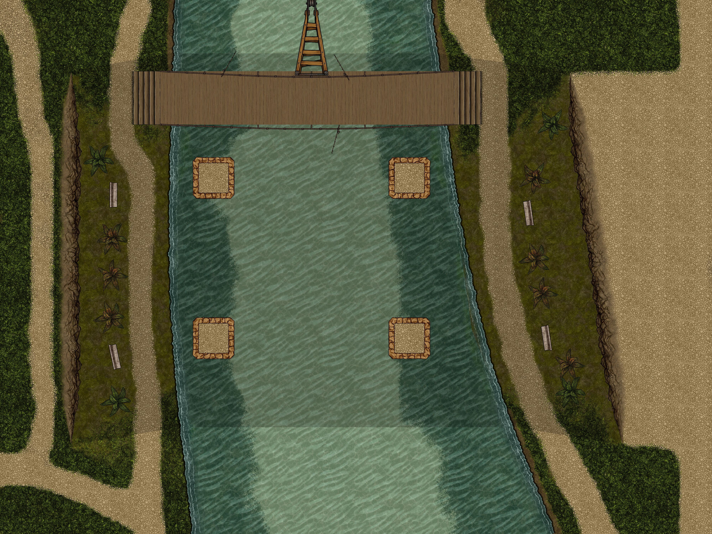

Thank you for trying this module. Tianze's Otari Extras is a collection of maps and content set in the town of Otari, which is the setting for Pathfinder scenarios including <i>Menace Under Otari</i> (the Beginner Box adventure), <i>Abomination Vaults Adventure Path</i> and <i>Troubles in Otari</i>. 

I decided to create this module as an introductory free work for my adventurers and maps. I created the original version of these maps while running the adventure, and once I started improving the maps using Forgotten Adventures assets, I decided to try my hand at module-making.

Maps were created with <a href="https://dungeondraft.net/" title="DungeonDraft">DungeonDraft</a> using assets from <a href="https://www.forgotten-adventures.net/" title="Forgotten Adventures">Forgotten Adventures</a>.

Top-down token images are also from <a href="https://www.forgotten-adventures.net/" title="Forgotten Adventures">Forgotten Adventures</a>.

Portraits and vignettes were created using <a href="https://www.bing.com/images/create" title="Bing Image Creator">Bing Image Creator</a>.

Macros were hacked together using using samples I found on either the Foundry's Reddit Pages, or in the Macro Polo chat in Foundry's discord. Many thanks to those who contributed these macros! However, many apologies as well, since my lack of Javascript expertise is woefully evident!

<h2>New!</h2>
<ul>
    <ul>New scene - Fish Camp Base with journals, items and encounters.</ul>
    <ul>Added journal versions of all merchants to support Monk's Enhanced Journals shop-based merchants.</ul>
    <ul>Added rolltables to use in either journal-based shops, or actor shops that have been enhanced with Item Piles.</ul>
    <ul>Lots of bugfixes and tweaks.</ul>
</ul>
<h2>What's Included</h2>
<ul>
    <li>
        
Crow's Casks

        <ul>
            <li>
                
Map

            </li>
            <li>
                
Location Journal Pages

            </li>
            <li>
                
Encounter - Rowdy Gamblers

            </li>
        </ul>
    </li>
    <li>
        
Crook's Nook

        <ul>
            <li>
                
Bridge Map

            </li>
            <li>
                
Tavern Map

            </li>
            <li>
                
Upper Story Map

            </li>
            <li>
                
Location Journal Pages

            </li>
            <li>
                
Encounter Series - Induction into the Osprey Club

            </li>
        </ul>
    </li>
    <li>
        
Dawnflower Library

        <ul>
            <li>
                
Location Journal Pages

            </li>
            <li>
                
Encounter from Chapter 2 of <em>Abomination Vaults</em>

            </li>
            <li>
                
Journal page for the theft of the Cooperative Blade, from <em>Abomination Vaults</em>.

            </li>
        </ul>
    </li>
    <li>
        
Otari Market

        <ul>
            <li>
                
Map

            </li>
            <li>
                
Location Journal Pages

            </li>
            <li>
                
Encounter - Rival Gang

            </li>
        </ul>
    </li>
    <li>
        
<em>Into the Ruins</em>, a short adventure based on an adventure hook from <em>Abomination Vaults</em>.

        <ul>
            <li>
                
Ruin Map

            </li>
            <li>
                
Warren Map

            </li>
            <li>
                
Location Journal Pages

            </li>
            <li>
                
Actors and Items

            </li>
        </ul>
    </li>
    <li>
        
Tavern Items

        <ul>
            <li>
                
A menu of consumable items used to stock service merchants including inns, market vendors, and stables.

            </li>
        </ul>
    </li>
    <li>
        
Merchant Actors with fully stocked inventory

        <ul>
            <li>
                
9 Merchants based on characters and places in Otari

            </li>
            <li>
                
7 Original Merchants

            </li>
        </ul>
    </li>
    <li>
        
Convenience Macros

        <ul>
            <li>
                
Many of the maps have tiny macros that will either toggle the visibility of tiles, or turn lights on and off at the same time. You can find these macros either in the relevant journal pages, or in the Macros folder, which is accessible by clicking the folder icon in the lower left corner of the macro bar. Look for the Tianze's Otari Extras folder.

            </li>
        </ul>
    </li>
</ul>
<h2></h2>Sample Map - Under Crook's Nook</h2>

<h2>Encounters and Map Philosophy</h2>

After making many maps that really served no purpose except for eye candy, maps such as inns and shops for which I never had enough miniatures or tokens to populate, I came up with the following rule:

<em>Every map deserves an encounter.</em>

Think of it as your creator's blessing for your map. After all, once you have a battle or other plot-moving encounter, the map setting is still available for its original purpose, whether it is an inn to stay at, a market to shop in, or a ruin to rebuild as a home base.

But to justify the existence of the map, I like to use it in some encounter that will move along the plot of the story I am trying to tell — whether it involves combat or not.

With that in mind, every map in this module has at least one encounter, which should fit into any Otari-based game.

<h2>Plans</h2>
Since I am actively running two Otari-based games, one using Abomination Vaults, I expect this module to grow. I am working on finishing up another module that more directly ties into <i>Abomination Vaults</i>.
